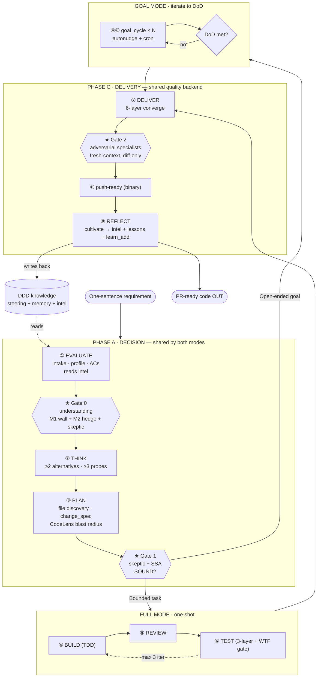

# Autonomous Pipeline — MeshClaw Port

A faithful port of [SwarmAI](https://github.com/xg-gh-25/SwarmAI)'s **Autonomous Pipeline**
(Phase 3: "Coding as Black Box") onto the **MeshClaw** agent runtime.

> One-sentence requirement in → PR-ready, adversarially-reviewed code out.
> **9 stages · 3 gates · 2 modes**, with a DDD knowledge loop that compounds every run.
>
> The thesis: **gates are structural, not behavioral.** A confident model cannot
> rationalize past a gate enforced in code. Carefulness doesn't scale; gates do.

## Architecture



## SwarmAI → MeshClaw primitive mapping

| SwarmAI | MeshClaw | Where |
|---------|----------|-------|
| skill `s_autonomous-pipeline` (markdown) | `.kiro/skills/autonomous-pipeline/` | `SKILL.md` + `INSTRUCTIONS.md` + `stages/*.md` |
| `artifact_cli.py` state machine + gates | `pipeline/pipeline_cli.py` | code-enforced Gate 0/1/2 + profile immutability |
| DDD docs (PRODUCT/TECH/IMPROVEMENT/PROJECT.md) | steering + memory + lessons | `.kiro/steering/*.md`, `learn_add` |
| Code Intelligence (blast radius) | CodeLens MCP | `pipeline/code_intel.py` (`get_impact`/`find_affected_tests`) |
| fresh-context adversarial sub-agents | `spawn_run` | Gate 0/1/2 spawns |
| Goal Mode + Job System (overnight) | autonudge loop + `cron_add` | `pipeline/goal_runner.py` |
| `pipeline_intelligence.json` meta-learning | same file | `run-cultivate` writes, `run-create` reads |
| REFLECT cultivation | steering append + `learn_add` queue | `run-cultivate` → `learn_queue.jsonl` |

## Layout

```
pipeline/
  pipeline_cli.py         # state machine + Gate 0/1/2 (code-enforced) + intel + cultivate
  code_intel.py           # CodeLens MCP wrapper (blast radius for PLAN/EVALUATE)
  goal_runner.py          # Goal-mode DoD driver (safeguards: budget/stuck/max-cycles)
  wtf_gate.py             # TEST-stage changeset risk scorer
  goals/*.json            # Goal-mode DoD specs
  .artifacts/runs/<id>/   # per-run artifacts + REPORT.md
  pipeline_intelligence.json
.kiro/skills/autonomous-pipeline/
  SKILL.md  INSTRUCTIONS.md  REVIEW_PATTERNS.md (RP1–RP50)  OPERATIONAL_PATTERNS.md (OP1–OP8)
  stages/{evaluate,think,plan,build,review,test,deliver,reflect,goal_cycle}.md
  stages/specialists/{correctness,security,performance,integration,api-contract,
                      concurrency,state-machine,red-team,operational}.md
.kiro/steering/pipeline-lessons.md   # auto-cultivated, Darwinian decay
```

## The three gates

| Gate | Guards | Fires | Enforcement |
|------|--------|-------|-------------|
| **Gate 0** | the framing (is the problem understood?) | inside EVALUATE | `publish --stage evaluate`: M1 solution-language wall + M2 hedge scan + skeptic verdict |
| **Gate 1** | the plan (right direction, root not symptom?) | after PLAN | `publish --stage plan`: `skeptic_ssa.verdict==SOUND` + structural-vs-patch |
| **Gate 2** | the build (is the code correct?) | inside DELIVER | `publish --stage deliver`: `adversarial_review.profile_tier=="full"` + no unresolved HIGH/MED + 6-layer |

Verified by 5 negative tests: each gate BLOCKs bad input (exit 3) and you cannot `advance` past it.

## Usage

Trigger in a MeshClaw session: **"run pipeline for X"** (skill is `tier: lazy`, auto-loads
`INSTRUCTIONS.md`). Or drive the CLI directly:

```bash
PIPE=python3 pipeline/pipeline_cli.py
RUN=$($PIPE run-create --project P --requirement "…" --profile full)   # intel auto-surfaces
# per stage: publish (gate runs) -> advance ; spawn sub-agents at Gate 0/1/2
$PIPE run-cultivate --run-id $RUN     # REFLECT: intel + steering lessons + learn_add queue
$PIPE run-report   --run-id $RUN      # -> .artifacts/runs/$RUN/REPORT.md
```

Goal mode: `goal_runner.py init|check|cycle-done --goal goals/<g>.json`; overnight via the
paused `goal-loop-*` cron (resume + point at a real goal).

## Learning docs

| Doc | What it teaches |
|-----|-----------------|
| [`docs/walkthrough-run-list.md`](docs/walkthrough-run-list.md) | Full replay of one real run (adding the `run-list` command) — every stage + all 3 gates, with mermaid flow + sequence diagrams. Includes a live Gate 2 catch (a builder blind spot escalated to HIGH). |
| [`docs/pipeline-on-surf-forecast.md`](docs/pipeline-on-surf-forecast.md) | How to apply the pipeline to the MeshClaw **surf-forecast** project: red-lines→gates mapping, CodeLens blast-radius commands, principle analysis (记性 vs 结构). |
| [`.kiro/skills/autonomous-pipeline/INSTRUCTIONS.md`](.kiro/skills/autonomous-pipeline/INSTRUCTIONS.md) | The orchestrator runbook: exact command sequence + gate/sub-agent/CodeLens/goal wiring. |

## Status & known gaps

Core mechanisms are real, runnable, and verified end-to-end (see `.artifacts/runs/`).
Deliberately simplified vs upstream SwarmAI:
- RP example-bug column trimmed (trigger + verify kept — that's the working checklist).
- `pipeline_intelligence.json` estimation is coarse (run/gate counts, not full token calibration).
- **CodeLens self-index requires the project on GitHub** (`generate_spec` indexes owner/repo);
  this project is local-only, so blast-radius on its OWN code is not yet available.

## Provenance

Ported from SwarmAI (MIT) — docs/Autonomous-Pipeline-Design.md + the `s_autonomous-pipeline`
skill. This port is a learning/experiment artifact in the `SwarmAI-learning` MeshClaw workspace.
