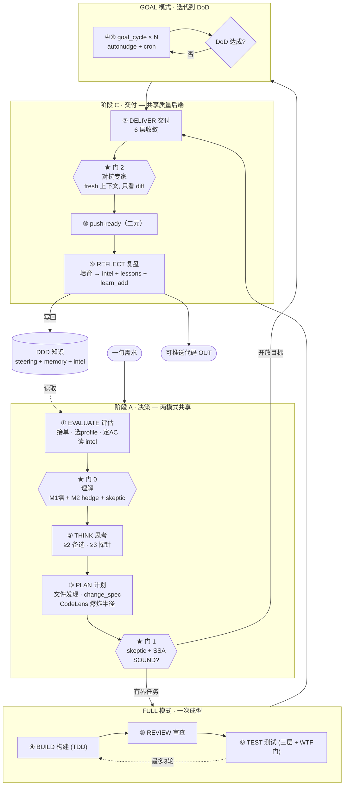

# SwarmAI → MeshClaw 移植（13 引擎）

[English](README.md) · **中文**

把 [SwarmAI](https://github.com/xg-gh-25/SwarmAI) 的**自进化 Agent OS** 学习式移植到
**MeshClaw** agent 运行时。始于**自主流水线**（引擎 #4），最终覆盖全部 **13 个引擎**：
5 个真实落地并端到端验证，7 个映射到 MeshClaw 原生能力，1 个 N/A。

> 一句需求进 → 可推送、经对抗审查的代码出。
> **9 阶段 · 3 道门 · 2 模式**，配一条每次运行都复利的 DDD 知识闭环。
>
> 核心论点：**门是结构，不是行为约束。** 自信的模型无法在代码强制的门前狡辩绕过。
> carefulness（小心）不可规模化；gate（门）可以。

## 13 引擎状态（全部有交代）

| # | 引擎 | 状态 | 位置 |
|---|------|------|------|
| 4 | 自主流水线 | ✅ 落地+验证 | `pipeline/pipeline_cli.py` + skill（[文档](docs/walkthrough-run-list.md)）|
| 13 | Eval OS | ✅ 落地+验证 | `pipeline/eval_os.py`（[文档](docs/eval-os.md)）|
| 3 | DDD 知识引擎 | ✅ 落地+验证 | `pipeline/ddd.py`（[文档](docs/ddd-engine.md)）|
| 6 | 自进化 | ✅ 落地+验证 | `pipeline/self_evolution.py`（[文档](docs/self-evolution.md)）|
| 5 | Pollinate 内容引擎 | ✅ 落地+验证 | `pipeline/pollinate.py`（[文档](docs/pollinate-engine.md)）|
| 2 | 记忆流水线 | ✅ 映射原生 | [文档](docs/memory-task-mapping.md) |
| 10 | 任务系统 | ✅ 映射原生 | [文档](docs/memory-task-mapping.md) |
| 1 · 7 · 8 · 9 · 12 | 上下文 · 自愈 · 多标签 · Hook · 技能+通道 | ✅ 映射原生 | [文档](docs/platform-base-mapping.md) |
| 11 | 4 平台后端 | ⬜ N/A（MeshClaw 本身*就是*运行时）| — |

**复利闭环（已闭合、可运行）：** 记忆 → 流水线判断（#4）→ DDD（#3）→ 进化（#6）→ 门控 → 记忆，
由 Eval（#13）证明收敛、Pollinate（#5）把同一套 DDD 层用于内容。端到端验证（见
`.artifacts/runs/`、PR #1–#4）。

## 架构



## SwarmAI → MeshClaw 原语映射

| SwarmAI | MeshClaw | 位置 |
|---------|----------|------|
| skill `s_autonomous-pipeline`（markdown）| `.kiro/skills/autonomous-pipeline/` | `SKILL.md` + `INSTRUCTIONS.md` + `stages/*.md` |
| `artifact_cli.py` 状态机 + 门 | `pipeline/pipeline_cli.py` | 代码强制 门 0/1/2 + profile 不可变 |
| DDD 文档（PRODUCT/TECH/IMPROVEMENT/PROJECT.md）| steering + memory + lessons | `.kiro/steering/*.md`、`learn_add` |
| Code Intelligence（爆炸半径）| CodeLens MCP | `pipeline/code_intel.py`（`get_impact`/`find_affected_tests`）|
| fresh-context 对抗子 agent | `spawn_run` | 门 0/1/2 spawn |
| Goal 模式 + Job 系统（过夜）| autonudge 循环 + `cron_add` | `pipeline/goal_runner.py` |
| `pipeline_intelligence.json` 元学习 | 同一文件 | `run-cultivate` 写、`run-create` 读 |
| REFLECT 培育 | steering 追加 + `learn_add` 队列 | `run-cultivate` → `learn_queue.jsonl` |

## 目录结构

```
pipeline/
  pipeline_cli.py         # 状态机 + 门 0/1/2（代码强制）+ intel + 培育
  code_intel.py           # CodeLens MCP 封装（PLAN/EVALUATE 的爆炸半径）
  goal_runner.py          # Goal 模式 DoD 驱动器（安全阀：预算/卡死/最大轮数）
  wtf_gate.py             # TEST 阶段变更集风险评分器
  goals/*.json            # Goal 模式 DoD 规格
  .artifacts/runs/<id>/   # 每次 run 的 artifact + REPORT.md
  pipeline_intelligence.json
.kiro/skills/autonomous-pipeline/
  SKILL.md  INSTRUCTIONS.md  REVIEW_PATTERNS.md (RP1–RP50)  OPERATIONAL_PATTERNS.md (OP1–OP8)
  stages/{evaluate,think,plan,build,review,test,deliver,reflect,goal_cycle}.md
  stages/specialists/{correctness,security,performance,integration,api-contract,
                      concurrency,state-machine,red-team,operational}.md
.kiro/steering/pipeline-lessons.md   # 自动培育，达尔文式衰减
```

## 三道门

| 门 | 守护 | 触发点 | 强制方式 |
|----|------|--------|----------|
| **门 0** | 框架（问题理解对了吗？）| EVALUATE 内 | `publish --stage evaluate`：M1 解决方案语言墙 + M2 hedge 扫描 + skeptic 裁决 |
| **门 1** | 计划（方向对吗、治本非治标？）| PLAN 之后 | `publish --stage plan`：`skeptic_ssa.verdict==SOUND` + 结构性 vs 补丁 |
| **门 2** | 构建（代码真的对吗？）| DELIVER 内 | `publish --stage deliver`：`adversarial_review.profile_tier=="full"` + 无未决 HIGH/MED + 6 层 |

由 5 个负向测试验证：每道门都会 BLOCK 坏输入（exit 3），且无法 `advance` 越过。

## 用法

在 MeshClaw 会话里触发：**「run pipeline for X」**（skill 为 `tier: lazy`，自动加载
`INSTRUCTIONS.md`）。或直接驱动 CLI：

```bash
PIPE=python3 pipeline/pipeline_cli.py
RUN=$($PIPE run-create --project P --requirement "…" --profile full)   # intel 自动浮现
# 每阶段：publish（门在此跑）-> advance；门 0/1/2 处 spawn 子 agent
$PIPE run-cultivate --run-id $RUN     # REFLECT：intel + steering lessons + learn_add 队列
$PIPE run-report   --run-id $RUN      # -> .artifacts/runs/$RUN/REPORT.md
```

Goal 模式：`goal_runner.py init|check|cycle-done --goal goals/<g>.json`；过夜用暂停的
`goal-loop-*` cron（resume 后指向真实目标）。

## 学习文档

| 文档 | 讲什么 |
|------|--------|
| [`docs/walkthrough-run-list.md`](docs/walkthrough-run-list.md) | 一次真实 run 全程复盘（给 CLI 加 `run-list`）—— 每个阶段 + 全部 3 道门，含 mermaid 流程图+时序图。含 Gate 2 活体命中（把 builder 盲点升级为 HIGH）。|
| [`docs/pipeline-on-surf-forecast.md`](docs/pipeline-on-surf-forecast.md) | 如何把流水线用在 MeshClaw **surf-forecast** 项目：红线→门映射、CodeLens 爆炸半径命令、原理分析（记性 vs 结构）。|
| [`docs/eval-os.md`](docs/eval-os.md) | Eval OS（引擎 #13）移植：Golden Set + 程序化/LLM-judge/simulation 三类评测 + git 绑定回归门 + 趋势。含"测不到=没造"突变演示。|
| [`docs/ddd-engine.md`](docs/ddd-engine.md) | DDD 知识引擎（引擎 #3）移植：4 文档接口 + 7 类本体 + Ebbinghaus/Hebbian 达尔文衰减 + 阶段注入 + REFLECT 写回。|
| [`docs/self-evolution.md`](docs/self-evolution.md) | 自进化（引擎 #6）移植：纠正 MINE→ASSESS→ACT→AUDIT、L0→L3 阶梯、复发类别 → 代码强制结构门。|
| [`docs/pollinate-engine.md`](docs/pollinate-engine.md) | Pollinate 内容引擎（引擎 #5）移植：一条消息 → 11 轨道 + 5 门品牌合规，与流水线共享 DDD 层。|
| [`docs/memory-task-mapping.md`](docs/memory-task-mapping.md) · [`docs/platform-base-mapping.md`](docs/platform-base-mapping.md) | 引擎 #2/#10 与 6 个平台底座引擎（#1/#7/#8/#9/#11/#12）映射到 MeshClaw 原生 —— 13 引擎全部有交代。|
| [`docs/surf-forecast-playbook.md`](docs/surf-forecast-playbook.md) | **全引擎操作手册** —— DDD+流水线+Eval+自进化+Pollinate 如何在 MeshClaw **surf-forecast** 上端到端协同，含 4 个可复制示例。|
| [`docs/eval-on-surf-forecast.md`](docs/eval-on-surf-forecast.md) · [`docs/ddd-on-surf-forecast.md`](docs/ddd-on-surf-forecast.md) | 把 Eval OS / DDD 用在 MeshClaw **surf-forecast**（红线 → 回归门 / 类型化本体）。|
| [`.kiro/skills/autonomous-pipeline/INSTRUCTIONS.md`](.kiro/skills/autonomous-pipeline/INSTRUCTIONS.md) | 编排运行手册：精确命令序列 + 门/子agent/CodeLens/goal 接线。|
| [`docs/LEARNINGS.md`](docs/LEARNINGS.md) | **收官心得** —— 移植 13 引擎真正学到的（门>小心、测不到=没造、复利涌现、会遗忘>只记住、该造vs该接）。|

## 现状与已知取舍

核心机制真实、可跑、端到端验证（见 `.artifacts/runs/`）。相对上游 SwarmAI 有意简化：
- RP 示例-bug 列裁掉（保留触发 + 核查 —— 那才是能用的清单）。
- `pipeline_intelligence.json` 估算较粗（run/门计数，非完整 token 校准）。
- **CodeLens 自索引需项目上 GitHub**（`generate_spec` 索引 owner/repo）；私有仓 404，转 public 后成功。

## 溯源

移植自 SwarmAI（MIT）—— docs/Autonomous-Pipeline-Design.md + `s_autonomous-pipeline` skill。
本移植是 `SwarmAI-learning` MeshClaw workspace 里的学习/实验产物。
