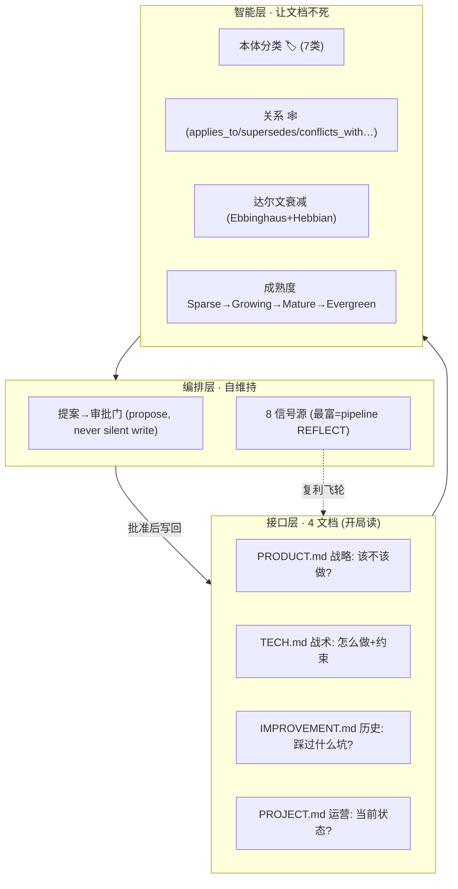
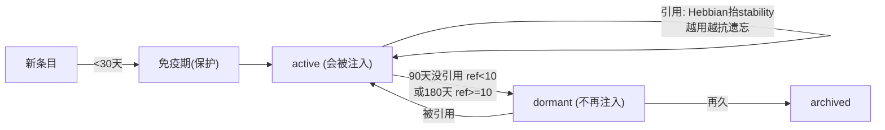
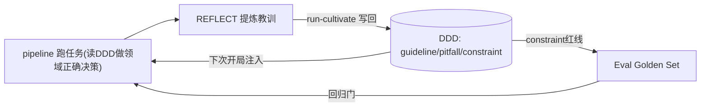

# DDD 知识引擎 —— 让 AI 开局就是领域专家（SwarmAI 引擎 #3 移植复盘）

> **一句话**：AI 是聪明的通才，但对你的项目一无所知，每次会话从零开始。DDD 把项目知识做成**自生长的活基础设施** —— 开局即领域专家，知识**越用越富、不用会死**（达尔文淘汰），且 prompt 成本恒定。

---

## 0. 为什么

- **AI 不懂你的项目**：不知道你的命名约定、为什么选 DynamoDB、上月试过什么失败了、哪个模块改前要审批。产出"技术对、领域错"。
- **文档会死**：写了、代码变了、文档没更新、没人信、没人读 —— 维护成本永远 > 感知收益。
- **知识困在单项目**：A 项目学到的教训，B 项目三个月后从头再踩。

DDD 的解法：知识**从正常工作里自动生长**（零人力维护），结构化给 AI 消费，健康度监控维持信任。

---

## 1. 三层架构（我们落地的核心）



**本体 🏷️ 7 类**（shipped HLD 是 5 类，我们加了 `constraint`/`convention`）：

| 类 | 含义 | 归属文档 | 注入阶段 |
|---|---|---|---|
| decision | 选 A 而非 B 及理由 | PRODUCT | evaluate, plan |
| constraint | 硬约束/红线(blocking) | TECH | evaluate, plan, review, test, deliver |
| convention | 命名/模式/做法约定 | TECH | build, review |
| model | 数据/结构长什么样 | TECH | build |
| process | 步骤流程 | TECH | build, deliver |
| pitfall | 别踩的坑 | IMPROVEMENT | build, review, test |
| guideline | 该这么做 | IMPROVEMENT | build, review |

---

## 2. 达尔文衰减 —— 知识必须能死



- `score = exp(-idle_days / stability)`（Ebbinghaus 遗忘曲线）
- 每个**不同 session** 的引用抬高 stability（Hebbian 强化 + Cepeda 间隔效应，防一次性刷 10 遍作弊）
- **只有 active 注入** → prompt 成本恒定（稳态 ~80 条），不随历史累积膨胀
- 实测:今天引用 score 1.0 / 20 天 0.513 / 60 天 0.135；100 天没引用 → dormant → 不注入

---

## 3. 复利飞轮 —— 和 pipeline / Eval 联动



- **pipeline → DDD**：`run-cultivate` 现在自动把 what_worked→guideline、what_failed→pitfall、rp_new→constraint 写进 DDD（实测生成 3 条本体条目）。
- **DDD → Eval**：constraint（红线）正是 Eval Golden Set 该编码的 assertions。
- **DDD → pipeline**：decision/constraint 在 EVALUATE/PLAN 开局注入，pitfall/guideline 在 BUILD/REVIEW 注入。

---

## 4. 操作命令

```bash
D="python3 pipeline/ddd.py"
$D add --type constraint --text "写DynamoDB前必须float->Decimal否则线上500" --source 红线
$D inject --stage build          # BUILD 该读哪些本体(active, 按 Ebbinghaus 分排序)
$D ref k_ab12 --session s7        # 引用: Hebbian 抬 stability(越用越抗遗忘)
$D decay                         # 达尔文淘汰: active->dormant->archived
$D list --decay active           # 看当前活跃知识
```

---

## 5. 现状与差距

**已落地**：4 文档模型 · 7 类本体 + 阶段注入 · Ebbinghaus/Hebbian 达尔文衰减 · 成熟度字段 · 关系数据结构 · **REFLECT→DDD 写回**（接进 pipeline_cli）。

**相对完整 SwarmAI 仍简化**：关系层只存不推理（没做 relevance boost / 矛盾检测 / 知识聚类）· 健康 5 维评分未实现 · 成熟度自动晋升/降级未实现 · 8 信号源只接了 pipeline REFLECT 这一条（最富的一条）· 审批门（propose-approve）未做（现在直接写）· Entity Index 跨项目路由未做。

> 参考：SwarmAI `docs/DDD-Cultivation-Engine-HLD.md`（原始设计）· 本仓库 `docs/eval-os.md`（Eval 联动）· `docs/walkthrough-run-list.md`（pipeline REFLECT 写回实景）。
