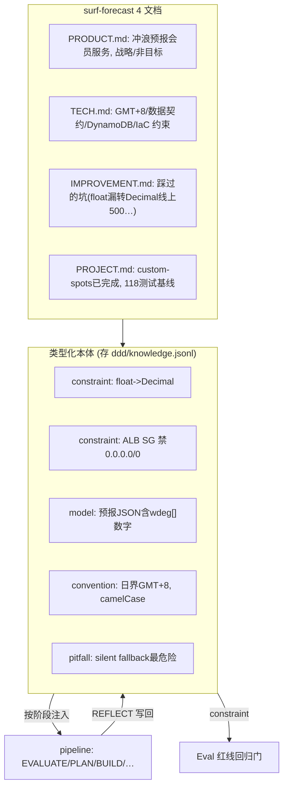
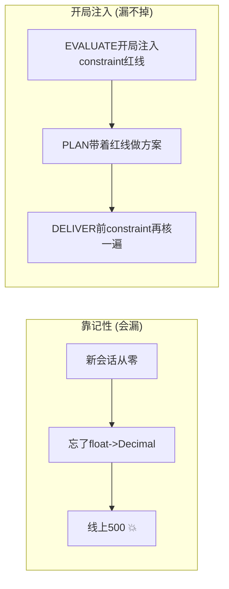

# 在 surf-forecast 上用 DDD 知识引擎 —— 操作指导 + 原理

> **一句话**：给 surf-forecast 建 4 份 DDD 文档 + 把红线/教训存成**类型化本体**，让 pipeline 每次开局就带着"该不该做/怎么做/踩过什么坑/当前状态"，红线自动在对应阶段注入，教训用完不用会自然退役 —— 领域知识越用越准、prompt 不膨胀。

---

## 0. 核心洞察

surf-forecast 的痛点是"红线靠记性、教训困在脑子里、新会话从零开始"。DDD 把这些变成**开局自动注入的活知识**：
- 红线（float→Decimal、wdeg 契约、ALB SG…）→ `constraint` 本体 → EVALUATE/PLAN/REVIEW/DELIVER 全程注入
- 过往教训 → `pitfall`/`guideline` → BUILD/REVIEW 注入
- 架构决策（选 DynamoDB 而非 RDS）→ `decision` → EVALUATE 注入

---

## 1. surf-forecast 的 DDD 长什么样



---

## 2. 详细操作

### 2.1 建 surf-forecast 的知识库（一次性种子）
```bash
SF=/Users/yiming/Downloads/all_the_meshclaw/surf-forecast/surf-forecast-kiro-v2
export DDD_STORE="$SF/ddd/knowledge.jsonl"          # 知识落在 surf-forecast 内, git 跟踪
D="python3 /Users/yiming/Downloads/all_the_meshclaw/SwarmAI-learning/pipeline/ddd.py"

# 红线 -> constraint（EVALUATE/PLAN/REVIEW/TEST/DELIVER 全程注入）
$D add --type constraint --text "写DynamoDB(boto3 resource)前必须 float->Decimal(src/web/db.py::_to_decimal), 否则线上500; moto单测不暴露" --source 红线
$D add --type constraint --text "ALB SG 永不含 0.0.0.0/0, 仅 pl-58a04531" --source 红线
$D add --type constraint --text "/api/spots 全部 401; slug 不可变(作缓存键)" --source 红线
$D add --type constraint --text "terraform apply/destroy 禁 -auto-approve" --source 红线
# 数据契约 -> model / convention
$D add --type model      --text "引擎JSON每日含 wdeg[] 数组; times/windows/hs/wind/gust 须为数字" --source DATA_CONTRACT
$D add --type convention --text "日界全程 GMT+8; 预报区与历史区日期互斥" --source 红线
# 决策 -> decision
$D add --type decision   --text "选 DynamoDB(Decimal+按需扩展) 承载预报结果" --source 架构
# 过往坑 -> pitfall
$D add --type pitfall    --text "silent fallback 是最危险bug: '能用'≠'正常工作'" --source COE
```

### 2.2 pipeline 各阶段自动注入
开发时（`run pipeline for X` 在 surf-forecast），每阶段读该读的本体：
```bash
$D inject --stage evaluate   # -> decision + 所有 constraint (红线)
$D inject --stage build      # -> convention/model/process/pitfall/guideline
$D inject --stage deliver    # -> constraint (Gate2 前再核一遍红线)
```

### 2.3 REFLECT 自动写回（零人力生长）
pipeline 跑完 `run-cultivate` 时，本轮 what_worked/what_failed/rp_new 会自动按本体类型进 surf-forecast 的 DDD（只要 `DDD_STORE` 指向它）。下次开发同模块，这条知识已在。

### 2.4 达尔文淘汰（prompt 不膨胀）
```bash
$D decay        # 90天没引用的老教训 -> dormant -> 不再注入; 常引用的(Hebbian)抗遗忘
```

---

## 3. 原理：为什么这样对 surf-forecast 有用



- **开局即专家**：4 文档 + constraint 红线在 EVALUATE 就注入，不靠 agent 记得。
- **红线全程护航**：constraint 类在 evaluate/plan/review/test/deliver **全阶段**注入 —— 最容易漏的 float→Decimal 每一步都在眼前。
- **零人力生长**：REFLECT 自动写回，这次踩的坑下次自动提醒（复利）。
- **不膨胀**：达尔文衰减让久未引用的教训退役，稳态活跃集 ~80 条，prompt 成本恒定。
- **和 Eval/pipeline 咬合**：constraint → Eval 红线回归门（机器查）；decision/pitfall → pipeline Gate（判断+人查）。三者共用一套知识。

---

## 4. 最快上手

1. `export DDD_STORE=$SF/ddd/knowledge.jsonl`，跑 §2.1 种子把 8 条红线/契约/决策入库。
2. 开发时 `ddd inject --stage <阶段>` 看该阶段注入什么（或让 pipeline 自动读）。
3. `run-cultivate` 时 `DDD_STORE` 指向 surf-forecast → 教训自动写回。
4. 定期 `ddd decay` 淘汰死知识。
5. constraint 类同步喂给 Eval 的 `redlines.jsonl`（见 `docs/eval-on-surf-forecast.md`）——同一套红线，判断层(DDD注入)+验证层(Eval回归门)双保险。

> 参考：本仓库 `docs/ddd-engine.md`（引擎原理）· `docs/pipeline-on-surf-forecast.md` · `docs/eval-on-surf-forecast.md` · surf-forecast `docs/codelens-feature-dev-sop.md`。
