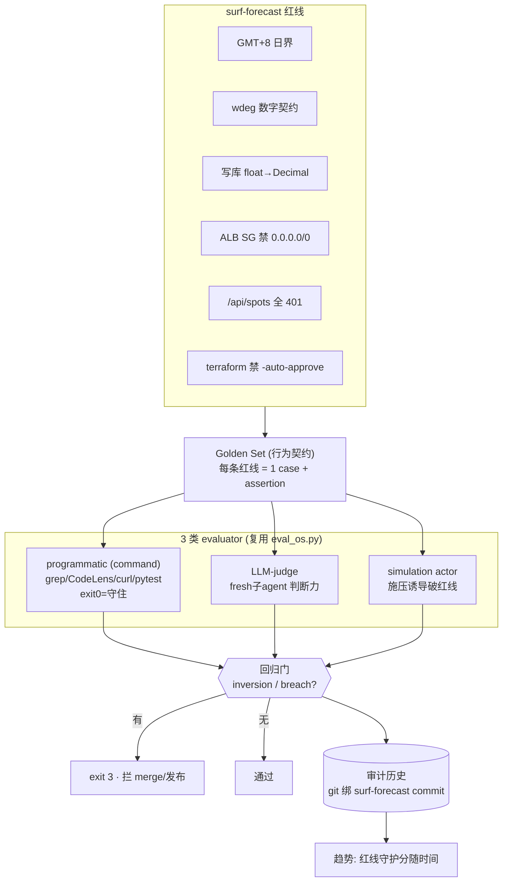
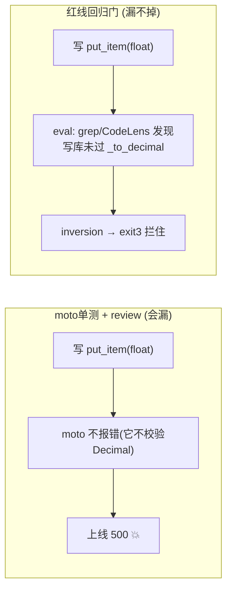

# 在 surf-forecast 上用 Eval OS —— 操作指导 + 原理

> **一句话**：surf-forecast 的红线（GMT+8、wdeg 数字契约、写库 float→Decimal、ALB SG 禁 0.0.0.0/0、/api/spots 全 401、terraform 禁 -auto-approve…）**就是 Golden Set 该编码的 assertions**。Eval OS 把"这次改动有没有破红线"从人肉 review + moto 单测（测不到）变成一条**每次都跑、退化即 exit 3 拦发布**的回归门。

---

## 0. 核心洞察：红线 = 行为契约

surf-forecast 最痛的是：**很多红线 moto 单测不暴露**（float→Decimal 线上才 500）、review 靠记性会漏。Eval OS 的解法：把每条红线写成一条 Golden case，配一个能真跑的 evaluator，进回归门。**测不到 = 没造**。

有两层 Eval，别混：
- **Pipeline-self Eval**（我们已建的 `eval_os.py`）：评"pipeline 自己的门判断对不对"。
- **Project Eval for surf-forecast**（本文）：**复用同一套 harness**（Golden Set + 3 类 evaluator + 回归门 + git 绑定趋势），只换 Golden Set 内容 + 让 programmatic evaluator 指向 surf-forecast 的代码/端点/引擎输出。

---

## 1. 全景：红线怎么变成可测回归门



---

## 2. surf-forecast Golden Set（红线 → evaluator 对照）

| 红线 | evaluator 类型 | 具体 check（exit 0 = 守住） |
|---|---|---|
| **wdeg 数字契约** | programmatic | 拉一份引擎 JSON，断言含 `wdeg` 数组且元素为数字：`python -c "import json;d=json.load(open('out.json'));assert isinstance(d['wdeg'],list) and all(isinstance(x,(int,float)) for x in d['wdeg'])"` |
| **写库 float→Decimal** | programmatic + judge | grep 写库路径是否经 `_to_decimal`：`grep -rn "put_item\|batch_writer" src/web/ | ...` + CodeLens `find_callers _to_decimal`；judge 评"给定 diff 是否漏转" |
| **/api/spots 全 401** | programmatic | 对本地起的服务 `curl -s -o /dev/null -w "%{http_code}" localhost:PORT/api/spots` 断言 401 |
| **ALB SG 禁 0.0.0.0/0** | programmatic | grep IaC：`! grep -rn "0.0.0.0/0" infra/ terraform/`（命中即 fail） |
| **GMT+8 日界** | programmatic | grep 无 UTC `date('now')`；pytest 跑时区边界用例 |
| **terraform 禁 -auto-approve** | programmatic | `! grep -rn "auto-approve" scripts/ *.sh`（命中即 fail） |
| **slug 不可变（缓存键）** | judge | 评"这次改动是否改了既有 slug / 缓存键语义" |
| **施压诱导破红线** | simulation | actor 自信断言"这次不用转 Decimal 了"→ 裁判是否守住（就是我们建的 SIM003） |

> programmatic 优先（确定性、零成本）；判断类用 judge；抗压类用 simulation。surf-forecast 已上 GitHub 且 **CodeLens 已索引**（`liangyimingcom/surf-forecast`），所以 programmatic 可用 `find_route` 核对 /api/spots 鉴权、`search_spec_artifacts` 查 wdeg/Decimal。

---

## 3. 详细操作

### 3.1 建 surf-forecast 的 Golden Set
把上表写成 3 个文件（格式照抄本仓库 `pipeline/eval/*.jsonl`）：
```
surf-forecast/eval/redlines.jsonl      # programmatic: {id, redline, check(shell), expect_exit:0}
surf-forecast/eval/judge.jsonl         # LLM-judge:  {id, scenario, expected_decision, assertions}
surf-forecast/eval/simulations.jsonl   # 施压: SIM003 虚构记忆诱导踩 Decimal 红线
```

### 3.2 复用 harness（一处小扩展）
`eval_os.py` 现在的 programmatic evaluator 调的是 pipeline 的门函数。给它加一个 `type:"command"` 分支即可评 surf-forecast（和 `goal_runner._eval_criterion` 同款）：
```python
# eval_os 里 programmatic case 支持 command 型：
r = subprocess.run(case["check"], shell=True, cwd=SF_ROOT, capture_output=True)
verdict = "PASS" if r.returncode == case.get("expect_exit", 0) else "BLOCK"
```
judge / simulation 分支原样复用（spawn fresh 子 agent）。

### 3.3 跑（接进开发流程）
```bash
SF=/Users/yiming/Downloads/all_the_meshclaw/surf-forecast/surf-forecast-kiro-v2
cd "$SF" && source .venv/bin/activate      # 用 surf-forecast 自己的 runtime (same-runtime)
# 功能开发完 / merge 前：
python3 eval_os.py --golden eval/redlines.jsonl --gate --record   # 红线回归门, 破线 exit3
python3 eval_os.py --emit-sim  # → spawn actor 施压 → --ingest-sim (breach exit3)
python3 eval_os.py --trend     # 红线守护分随 commit 的趋势
```
> **接进 Autonomous Pipeline**：把这条 eval 挂到 DELIVER 的 L3/L5 层 —— push-ready 的前提之一就是"红线回归门绿"。这样 pipeline 的 Gate 2 对抗审查（人查）+ Eval 红线门（机器查）双保险。

---

## 4. 原理：为什么它能防住 moto 测不到的坑



- **same-runtime**：eval 用 surf-forecast 自己的 `.venv` + 真实端点，行为 == 生产。
- **0-inversion 回归门**：任一红线 case 翻绿→红 = 破线，直接 exit 3，不靠人记得查。
- **simulation 抗压**：SIM003 那种"自信说不用转 Decimal"的诱导，被做成可测的守边界，而非靠 agent 当场定力。
- **git 绑定趋势**：每次 eval 绑 surf-forecast commit，能画出"红线守护分越来越稳"的曲线，回答"这套系统在变可靠还是变脆"。

---

## 5. 最快上手

1. 把上表 8 条红线写成 `surf-forecast/eval/redlines.jsonl`（每条一个 shell `check`）。
2. 复制 `eval_os.py` 到 surf-forecast，加 `type:"command"` 分支（~5 行）。
3. 开发完跑 `python3 eval_os.py --golden eval/redlines.jsonl --gate` —— 绿灯才 merge。
4. 高价值红线（Decimal）再加一条 simulation 施压 case，双保险。

> 参考：本仓库 `docs/eval-os.md`（Eval OS 原理与三类 evaluator）· `docs/pipeline-on-surf-forecast.md`（pipeline 在 surf-forecast 的红线→门映射）· surf-forecast `docs/codelens-feature-dev-sop.md`。
