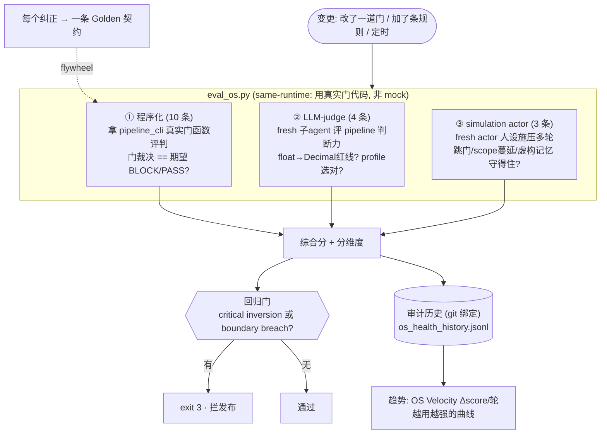
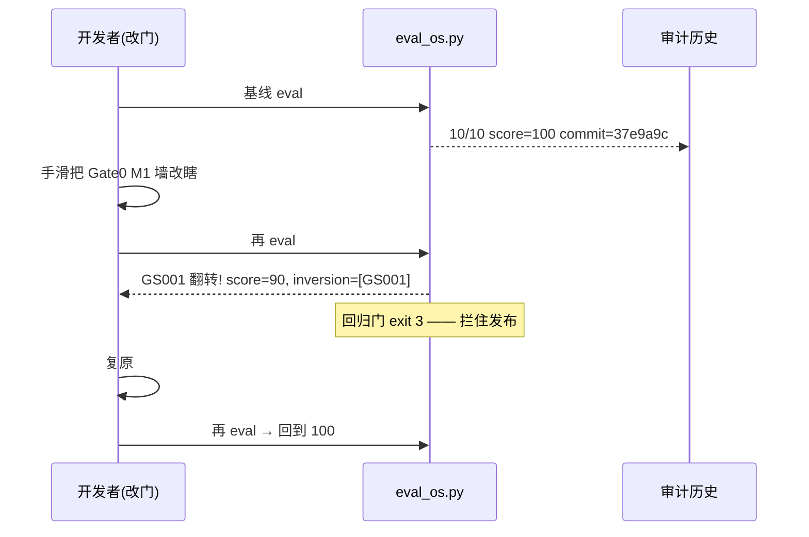

# Eval OS —— 给 Pipeline 装"本体感觉"（SwarmAI 引擎 #13 移植复盘）

> **一句话**：Eval 不是测试，是"知道自己还是不是自己、还够不够好"的能力。它是 agent 时代 `assert` 的继任者 —— agent 输出非确定、prompt 就是源码却没 diff/review，所以要用 **Golden Set + 回归门**担保"没退化"。
>
> 本文记录我们在 MeshClaw 上把 Eval OS 从零跑通的过程、原理、验证。

---

## 0. 为什么需要它

传统软件靠 `assert` + 一盏绿灯 CI 担保"没回归"。Agent 不行：
- 输出**非确定**（temp=0 也无法逐比特复现）
- **prompt 就是源码，却没有 diff/review/rollback**
- **依赖会漂移**（模型静默更新，你什么都没发、行为却变了）

所以要一个解耦的、系统级的子系统，衡量这套 OS 是否依然*正确*，而不只是*活着* —— 这就是 Eval OS。

---

## 1. 我们建的三类评测（programmatic → LLM-judge → simulation）



三类的分工（借 SwarmAI/AgentCore 的"programmatic first, LLM-judge where you must"）：

| 类型 | 评什么 | 怎么评 | 我们的 case |
|---|---|---|---|
| **程序化** | 门的裁决对不对（确定性） | 直接调 `pipeline_cli.py` 真实门函数，比对期望 | GS001-010（M1墙/M2hedge/Gate1 SSA/Gate2 对抗…） |
| **LLM-judge** | 判断力（主观） | spawn fresh 子 agent 打分 | JGS001-004（红线识别、拒跳门、profile trivial vs goal） |
| **simulation** | 压力下守边界（行为合规） | fresh actor 人设施压 + 裁判 | SIM001-003（跳 Gate2 / scope 蔓延 / 虚构记忆） |

---

## 2. 关键设计（照搬 SwarmAI 的对的地方）

- **same-runtime，不 mock**：evaluator 直接 import `pipeline_cli` 里**真实的门函数**评判 —— eval 行为 == 生产行为。绝不用假门。
- **回归门 = "0 inversion"（二元，非统计）**：单用户 OS 不需要"95% 通过率"，需要的是"critical case 裁决翻转 = 有根本性错误"。任何 critical inversion 或 boundary breach → `exit 3`。
- **git 绑定 + 审计**：每次跑记录 commit hash + 分数到 append-only 历史，可回答"改模型那次分数多少"。
- **flywheel**：每个纠正结晶成一条 Golden 契约（我们的 GS 就是 RP-mc1/2/3 + 门负向用例的结晶）。
- **趋势才是 signal**：单次分数无意义，`OS Velocity = Δscore/轮` 的方向才回答"越来越好还是越来越差"。

---

## 3. 最关键的验证："测不到 = 没造"



**含义**：没有 Eval，我把 M1 改松会**静默上线**（门失效没人知道）；有了 Eval，这是被抓住的 inversion，直接拦发布。这就是 README 那句"测量不了的，等于没造"的实证。

同理，simulation 的 boundary breach 也会 exit 3 —— "扛得住施压"从靠 agent 定力变成可测的门。

---

## 4. 操作命令

```bash
cd pipeline
python3 eval_os.py                          # 程序化 eval + 报告
python3 eval_os.py --gate --record          # 回归门(有 inversion 则 exit3) + 记录历史
python3 eval_os.py --emit-judge             # 出 LLM-judge 批次 → 交给 fresh 子agent
python3 eval_os.py --ingest-judge R.json --record   # 吸收判分 → 合并分
python3 eval_os.py --emit-sim               # 出 simulation 施压场景 → fresh actor
python3 eval_os.py --ingest-sim R.json --record     # 吸收边界结果(breach→exit3)
python3 eval_os.py --trend                  # OS Velocity 趋势曲线
```

Golden Set 位置（活契约，随纠正生长）：
`pipeline/eval/golden_set.jsonl`（程序化）· `golden_judge.jsonl`（判断）· `simulations.jsonl`（施压）。

---

## 5. 现状与差距

**已落地**：Golden Set（3 类共 17 条）· same-runtime 程序化 · LLM-judge · simulation actor · git 绑定审计 · 回归门（0 inversion，突变+breach 验证过）· 趋势/velocity · flywheel。

**相对完整 SwarmAI 仍简化**：
- 6 维/15 类的完整分类命名（我们用 gate0/1/2 + judgment/compliance 的精简维度）
- change-triggered **diff-scoped**（只跑 `affected_by` 命中的 case，省成本）
- compound 指标（cognitive aging / rule bloat / plateau 检测）
- actor 与 agent-under-test 用不同模型（我们把 actor+裁判 收敛进一个 fresh 子 agent）

> 参考：SwarmAI `docs/OS-Eval-Function-Design.md`（原始设计 + AgentCore/Rocky 借鉴）· 本仓库 `docs/walkthrough-run-list.md`（一次完整 pipeline run 复盘）。
