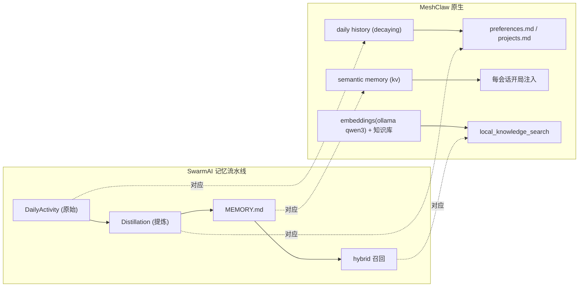
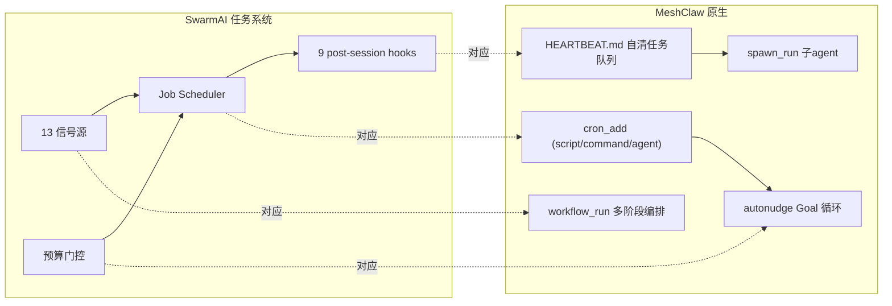

# Step 4/5 —— 记忆流水线(#2) + 任务系统(#10)：映射 MeshClaw 原生

> **一句话**：这两个引擎不需要在本项目重造 —— **MeshClaw 运行时已原生提供**。本文把 SwarmAI 的设计映射到 MeshClaw 的对应能力，说明"哪里现成、哪里我们已借用、哪里可补"。

---

## 引擎 #2 · 记忆流水线（4 层持久化：DailyActivity → 蒸馏 → 复利召回）

### SwarmAI 设计
DailyActivity(原始会话日志, 30d TTL) → Distillation(≥3 个未处理文件时提炼复发主题) → MEMORY.md(agent 记忆) → 混合向量+关键词召回。3 层蒸馏管线 + section caps + 时间戳(valid_from/superseded_by)。

### MeshClaw 原生对应

| SwarmAI | MeshClaw 原生 | 状态 |
|---|---|---|
| DailyActivity 原始日志 | workspace `memory/history`（180 天衰减） | ✅ 现成 |
| Distillation 蒸馏 | preferences.md / projects.md（对话学到的偏好/项目） | ✅ 现成 |
| MEMORY.md agent 记忆 | semantic memory（kv 事实）+ 每会话注入 | ✅ 现成 |
| 混合向量+关键词召回 | embeddings(ollama qwen3-embedding, dim=1024) + `local_knowledge_search` | ✅ 现成 |
| REFLECT 写回记忆 | `learn_add`（跨会话 lessons）+ 本项目 DDD 写回 | ✅ 已借用 |

**结论**:记忆流水线 MeshClaw 100% 有原生对应，无需重造。我们的 pipeline REFLECT 已经在用 `learn_add` + DDD 写回接进这一层。

---

## 引擎 #10 · 任务系统（后台智能：13 信号源，定时任务，预算门控）

### SwarmAI 设计
Job Scheduler + Service Manager；9 个 post-session hooks（DailyActivity/Distillation/Evolution/…）；信号源触发；预算门控；MINE→ASSESS→ACT 后台跑。

### MeshClaw 原生对应

| SwarmAI | MeshClaw 原生 | 状态 |
|---|---|---|
| Job Scheduler（定时/一次性） | `cron_add`（every/cron_expr/at；script/command/agent 三型） | ✅ 现成 |
| post-session hooks（会话后处理） | HEARTBEAT.md 自清任务队列 + hooks | ✅ 现成 |
| 后台自主执行 + 预算门控 | **autonudge Goal 循环** + `goal_runner.py` 的 budget/stuck 阀 | ✅ 已借用（Step 0 就用了） |
| 信号源触发 | cron script `ctx.call_tool` / workflow_run 事件 | ✅ 现成 |
| 过夜自主到 DoD | autonudge + cron（LeagueApparel 实证 7 cycles） | ✅ 已验证 |

**结论**:任务系统 MeshClaw 也 100% 有原生对应。我们的 Goal 模式（`goal_runner.py` + 暂停的 `goal-loop-*` cron）就是这一层的落地，`self_evolution.py` 的 MINE→ASSESS→ACT 也是后台智能的一种。

---

## 为什么这两个不重造（架构判断）

SwarmAI 是**独立桌面 App**，必须自带记忆持久化 + 任务调度这些"平台底座"。**MeshClaw 本身就是那个底座** —— 它已经提供 memory/history/lessons/embeddings + cron/autonudge/heartbeat/spawn/workflow。在 MeshClaw 上重造一套记忆库和调度器是重复劳动，正确做法是**把 pipeline/DDD/进化接到 MeshClaw 原生能力上**（我们已经这么做了）。

这和引擎 #1(上下文)/#7(自愈)/#8(多标签)/#9(Hook)/#11(4平台) 是同一类判断:**平台底座层，MeshClaw 原生，学映射不重造。**

---

## 与已落地引擎的关系

- 记忆(#2) → pipeline REFLECT 写 `learn_add` + DDD；EVALUATE 开局读注入。
- 任务(#10) → Goal 模式 autonudge/cron；自进化(#6) 的后台定级也可挂 cron。

> 参考：`docs/ddd-engine.md`（REFLECT→DDD 写回）· `docs/self-evolution.md`（后台定级）· 常用管理命令.md（MeshClaw 记忆/cron 实操）· `.kiro/skills/autonomous-pipeline/stages/goal_cycle.md`（autonudge/cron 接线）。
