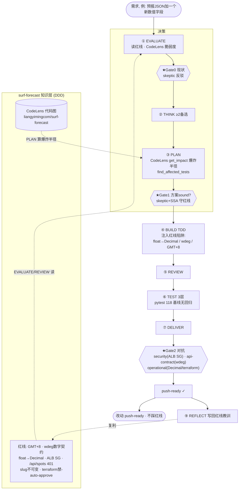
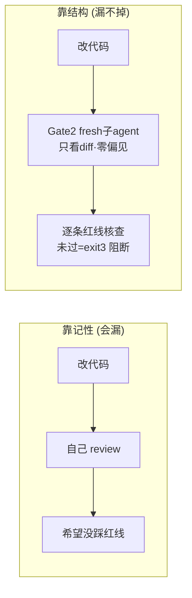

# 在 surf-forecast 上用 Autonomous Pipeline —— 操作指导 + 原理

> **一句话**：surf-forecast 红线多（GMT+8 日界、DATA CONTRACT 含 wdeg、DynamoDB 必须 float→Decimal、ALB SG 禁 0.0.0.0/0、terraform 禁 -auto-approve…），一次手滑就线上 500 或安全事故。Autonomous Pipeline 把这些红线做成**代码强制的门 + 对抗审查**，让"改功能不踩红线"从"靠记性"变成"靠结构"。

---

## 0. 为什么 surf-forecast 特别适合这套 pipeline

| surf-forecast 的痛点 | Pipeline 对应的结构性保护 |
|---|---|
| 红线多、moto 单测不暴露（如 float→Decimal 线上才 500） | Gate 2 **security/api-contract/operational 专家**对着 diff 逐条查红线 |
| 改一处怕连累别处（评分/物理/web/IaC 耦合） | PLAN 用 **CodeLens `get_impact`** 算真实爆炸半径 + `find_affected_tests` |
| 118 条 pytest 基线，怕回归 | TEST 三层验证 + DELIVER L3「无回归」层 |
| 已上 GitHub 且 **CodeLens 已索引**（`liangyimingcom/surf-forecast`, public） | EVALUATE/PLAN 直接查代码图，不靠猜 |

---

## 1. 一次 surf-forecast 功能开发的全景



---

## 2. 详细操作（复制即用）

### 前置：让 pipeline 工具对 surf-forecast 可用
pipeline 的 skill + CLI 现在在 `SwarmAI-learning`。两种接法，任选：

**方式 A（推荐·全局装 skill）** —— 让任何项目都能触发：
```bash
# 把 skill 复制到全局 skills 目录
cp -r /Users/yiming/Downloads/all_the_meshclaw/SwarmAI-learning/.kiro/skills/autonomous-pipeline \
      ~/.kiro/skills/
# CLI 与产物：在 surf-forecast 里建一个 pipeline 工作区
SF=/Users/yiming/Downloads/all_the_meshclaw/surf-forecast/surf-forecast-kiro-v2
cp /Users/yiming/Downloads/all_the_meshclaw/SwarmAI-learning/pipeline/*.py "$SF/pipeline/" 2>/dev/null || mkdir -p "$SF/pipeline" && cp /Users/yiming/Downloads/all_the_meshclaw/SwarmAI-learning/pipeline/*.py "$SF/pipeline/"
```

**方式 B（最省事·直接触发）** —— 不复制，在会话里把项目切到 surf-forecast，然后对我说
**「run pipeline for <需求>」**。skill 是编排器，红线来自 surf-forecast 的 steering，代码图来自 CodeLens —— 工具在哪不重要。

### 摸底（动手前必做，守红线的第一步）
```bash
source ~/.meshclaw/secrets/codelens.env        # CODELENS_TOKEN
PKG=liangyimingcom/surf-forecast
CI="python3 pipeline/code_intel.py"
$CI symbol         --package $PKG --query score_wind          # 定位符号 (scoring.py:94)
$CI impact         --package $PKG --symbol score_wind         # 爆炸半径: 上游31/下游4
$CI affected-tests --package $PKG --symbol score_wind         # 改它要重跑哪些测试
```

### 跑 pipeline（full 档为例）
```bash
SF=/Users/yiming/Downloads/all_the_meshclaw/surf-forecast/surf-forecast-kiro-v2
cd "$SF"
export PIPELINE_ARTIFACTS_ROOT="$SF/.pipeline-artifacts"     # 产物落在 surf-forecast 内
PIPE="python3 pipeline/pipeline_cli.py"

RUN=$($PIPE run-create --project surf-forecast \
  --requirement "在预报 JSON 增加阵风比 gustRatio 数值字段" --profile full \
  | python3 -c "import sys,json;print(json.load(sys.stdin)['run_id'])")

# 每阶段 publish(门在此跑) -> advance；Gate 0/1/2 处 spawn fresh 子agent
# ...(见 walkthrough-run-list.md 的完整命令序列)...
$PIPE run-cultivate --run-id $RUN     # 红线教训写回
$PIPE run-report   --run-id $RUN
```
> 测试用 surf-forecast 自己的 `.venv` + pytest（基线 118）：`source .venv/bin/activate && pytest -q`。

---

## 3. 红线 → 门 的对应（surf-forecast 专属核对表）

| 红线 | 哪一阶段/门守 | 具体核查 |
|---|---|---|
| **GMT+8 日界**（预报区/历史区日期互斥） | PLAN(Gate1) + Gate2 correctness | 日期计算全程 GMT+8；不用 UTC `date('now')`（RP18） |
| **DATA CONTRACT 含 wdeg，图表字段须数字** | Gate2 **api-contract** | 引擎 JSON 每日含 wdeg 数组；times/windows/hs/wind/gust 为数字 |
| **DynamoDB 写入 float→Decimal**（moto 不暴露） | BUILD + Gate2 **operational** | 写库前用 `src/web/db.py::_to_decimal`；否则线上 500 |
| **ALB SG 永不含 0.0.0.0/0**（仅 pl-58a04531） | Gate2 **security** | 审 IaC diff 里的安全组入站规则 |
| **/api/spots 全 401** | Gate2 **security/api-contract** | 认证守卫在；用 `find_route` 核对路由鉴权 |
| **slug 不可变（作缓存键）** | Gate1 SSA + Gate2 correctness | 不改既有 slug；缓存键稳定 |
| **terraform 禁 -auto-approve** | Gate2 **operational** | 任何 IaC 变更不得自动 apply/destroy |

> 这张表本质就是把 surf-forecast 的 `IMPROVEMENT.md/TECH.md`（红线）挂到 REVIEW_PATTERNS/specialists 上。REFLECT 每次会把新踩的红线补进这张表（复利）。

---

## 4. 原理分析（为什么这样设计）



- **门是代码强制的**：`publish --stage deliver` 没有 `adversarial_review.profile_tier=="full"` 或有未闭 HIGH/MED → exit 3，无法推进。你无法"因为很自信"跳过。
- **fresh 上下文对抗**：float→Decimal 这种坑，写代码的人容易"我记得处理了"；一个只看 diff、碰不到你思路的子 agent 才会真去核对 `_to_decimal` 有没有被调。
- **CodeLens 提供事实**：改评分函数前先 `get_impact` 看 31 个上游谁会受影响、`find_affected_tests` 看要重跑哪些 —— 爆炸半径靠数据不靠猜。
- **复利**：REFLECT 把"这次差点漏 Decimal"写回 intel + steering + learn_add，下次 EVALUATE 自动提醒。红线越用越全。

---

## 5. 最快上手

1. 在会话里把项目切到 surf-forecast（或按方式 A 装好 skill）。
2. 对我说 **「run pipeline for <你的需求>」**。
3. 我会：先 CodeLens 摸底 → Gate 0 确认现状 → PLAN 算爆炸半径 + 守红线 → TDD 实现 → Gate 2 派专家对着 diff 查 float→Decimal/wdeg/ALB SG → 收敛 → 生成 REPORT，全程不踩红线。

> 参考：`docs/walkthrough-run-list.md`（一次完整跑的复盘）· surf-forecast 的 `docs/codelens-feature-dev-sop.md`（CodeLens 调用 SOP）· skill 的 `INSTRUCTIONS.md`（命令序列）。
