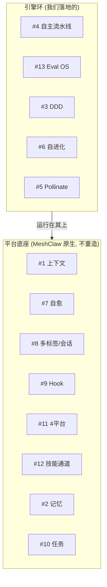
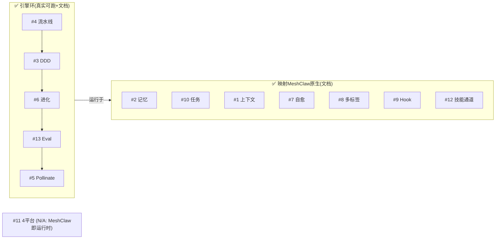

# 平台底座 6 引擎 —— 映射 MeshClaw 原生（13 引擎收官）

> **一句话**：SwarmAI 有 13 个引擎，其中 6 个是**独立桌面 App 的平台底座**（上下文/自愈/多标签/Hook/4平台/技能通道）。MeshClaw 本身就是那个底座 —— 这 6 个**不重造，学映射**。至此 13 引擎全部有落地或映射。

---

## 为什么这 6 个不重造

SwarmAI 是一个 Tauri 桌面 App，必须自带上下文拼装、崩溃自愈、多会话隔离、Hook 生命周期、跨平台后端、技能加载 —— 这些是"让一个 stateless LLM 变成持久 agent"的**平台底座**。

**MeshClaw 就是这个底座**。在 MeshClaw 上重造它们 = 重复造轮子。正确做法：把已落地的 5 个"引擎环"（#4/#13/#3/#6/#5）+ 记忆#2/任务#10 接到 MeshClaw 原生能力上。

---

## 6 引擎映射表

| # | SwarmAI 引擎 | 做什么 | MeshClaw 原生对应 | 状态 |
|---|---|---|---|---|
| **1** | 上下文管理 | 11 文件 Prompt 架构, 100K 预算, 三层所有权, 优先级截断 | MeshClaw 会话上下文系统:memory/steering/lessons 注入 + 预算管理 + skill `tier:lazy` 懒加载(97→71 tok 同款思路) | ✅ 原生 |
| **7** | 自愈合 | 5 传感器, 自动重生, 用户无感 | MeshClaw **session healing** + **HEARTBEAT** 自清任务队列 + gateway 重连(MCP transient disconnect 自恢复) | ✅ 原生 |
| **8** | 多标签页 + MessageStore | 并发会话, 阶段门控单写者, 跨标签隔离 | MeshClaw dashboard 多会话/多 chat slot + workspace 隔离 + cron `hide_in_chat`/session slot 管理 | ✅ 原生 |
| **9** | Hook 系统 | 运行时 + 生命周期 hooks, 会话永不冷启动 | MeshClaw hooks + **autonudge**(会话间热启动) + programmatic script hooks(上下文注入) | ✅ 原生 |
| **11** | 4 平台后端 | macOS daemon · Hive(EC2) · Windows · Linux, 编译时隔离 | 不适用:MeshClaw 是运行时本身;我们跑在 MeshClaw dashboard(macOS) | ⬜ N/A |
| **12** | 技能 + 通道 | 88 技能(lazy/always), Slack 网关, 三层权限 | MeshClaw `.kiro/skills/`(我们的 autonomous-pipeline 就是一个) + Slack 网关(send_message) + 工具审批(approval_mode) | ✅ 原生(已用) |

---

## 关键映射细节

### #1 上下文 —— 我们已经在用
- pipeline skill 是 `tier: lazy`(触发才加载 INSTRUCTIONS.md) = SwarmAI 的 lazy/always 分层同款省 token 策略。
- DDD 的**渐进加载**(§progressive loading:开局只加载 [Mature]/[Evergreen], 其余按需拉) = 上下文预算管理的应用。我们的 `ddd inject --stage` 就是"按需拉该阶段该读的本体"。

### #7 自愈 —— 已被动用到
- 本次 session 多次出现 "N tools disconnected → N tools available again" 的 MCP transient 重连 = MeshClaw 自愈的一种(我们照规则重试未中断任务)。
- HEARTBEAT.md 自清队列(之前监控 CodeLens 索引完成)= 后台自愈/续跑机制。

### #9 Hook —— autonudge 就是"会话永不冷启动"
- SwarmAI 的 21 hooks 在会话间触发让下一个会话热启动;MeshClaw 的 **autonudge**(我们 Goal 模式用的) + cron 就是等价机制 —— LeagueApparel 的 7-cycle 过夜自主就靠它。

### #12 技能通道 —— 本项目本身就是证据
- `autonomous-pipeline` skill(SKILL.md `tier:lazy` + TRIGGER 词)本会话开局就被 MeshClaw 索引列出 —— 说明技能系统原生可用。
- Slack 网关 = `send_message(session="slack")`;三层权限 = cron 的 `approval_mode`/工具审批。

---

## 13 引擎全景收官

| 类别 | 引擎 | 交付形态 |
|---|---|---|
| **引擎环(落地)** | #4 #13 #3 #6 #5 | 代码 + 端到端验证 + mermaid 复盘文档 |
| **映射原生(文档)** | #2 #10 #1 #7 #8 #9 #12 | 映射分析文档 |
| **N/A** | #11 | MeshClaw 就是运行时 |

**结论**:SwarmAI 13 引擎在 MeshClaw 上全部有交代 —— 5 个真实落地并验证，7 个映射到 MeshClaw 原生，1 个 N/A。复利闭环(记忆→判断→DDD→进化→门控→记忆 + Eval 证明收敛 + Pollinate 内容同构)在 MeshClaw 原语上闭合、可跑、可复现。

> 参考：`README.md`(全景 + 映射表) · `docs/memory-task-mapping.md`(#2/#10 详版) · 各引擎复盘文档。
