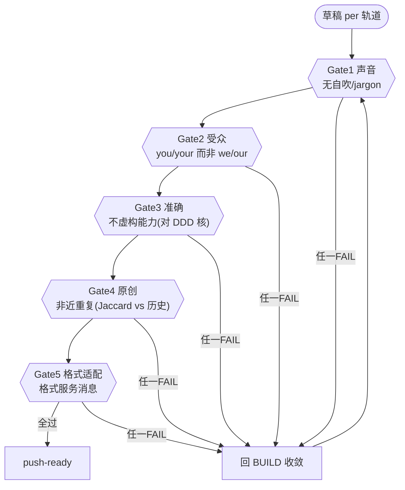
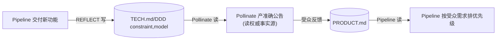

# Pollinate 内容引擎 —— 一条消息 → 多格式品牌正确内容（SwarmAI 引擎 #5 复盘）

> **一句话**：让 Pipeline 产出**领域正确代码**的同一套 DDD 知识层，也让 Pollinate 产出**品牌正确内容**。两个引擎结构相同（阶段式 + 质量收敛 + DDD 飞轮），只是领域不同 —— 代码交付 vs 内容交付。**知识层是平台，引擎是镜头。**

---

## 0. 它解决什么

"AI 会写"≠"AI 会产出品牌正确的内容"。无持久上下文的通用 AI 有 5 个失败：
1. **语气漂移**:周一"we're thrilled"、周三"we're proud" —— 声音没锚。
2. **自吹自擂**:默认庆祝模式,"颠覆性""世界领先" —— 内容在说自己不是说受众。
3. **虚假技术声明**:声称不存在的能力（没有 current-state 的事实来源）。
4. **信息疲劳**:同一角度重复第 5 遍。
5. **格式-消息错配**:复杂论点塞进海报,简单公告拉成长文。

根因都是**上下文缺失**,不是智能不足。Pollinate 用同一套 DDD 补上。

---

## 1. 和代码 Pipeline 完全同构

```mermaid
flowchart LR
    subgraph CODE["Pipeline (代码)"]
        c1["EVALUATE 该建吗"]-->c2["THINK 什么approach"]-->c3["PLAN 架构"]-->c4["BUILD 写码TDD"]-->c5["REVIEW 质量"]-->c6["TEST 验证"]-->c7["DELIVER"]-->c8["REFLECT"]
    end
    subgraph CONTENT["Pollinate (内容)"]
        p1["EVALUATE 该产吗"]-->p2["THINK 什么角度"]-->ps["STRATEGIZE PR/FAQ+渠道×格式"]-->p3["PLAN content_package"]-->p4["BUILD 各轨道原生产出"]-->p5["REVIEW 5门品牌合规"]-->p6["TEST 渲染+平台校验"]-->p7["DELIVER 打包发布"]-->p8["REFLECT"]
    end
    DDD[("DDD 4文档: PRODUCT/TECH/IMPROVEMENT/PROJECT")]
    DDD -.同一套知识.-> CODE
    DDD -.同一套知识.-> CONTENT
    c8 -.写回.-> DDD
    p8 -.写回.-> DDD
```



| Pipeline | Pollinate | 共享模式 |
|---|---|---|
| 6 层 Push-Ready 门 | **5 门品牌合规** | 多维质量校验 |
| 迭代到正确 | 迭代到品牌正确 | 质量收敛(≤3轮) |
| REFLECT→DDD | REFLECT→DDD | 知识写回 |

---

## 2. 5 门品牌合规（我们落地的核心）



实测（`pollinate.py gate`）：
- **Gate1 声音** 拦"我们很高兴地宣布…颠覆性…世界领先" → exit 3。
- **Gate2 受众** we>you 判 company-centric。
- **Gate3 准确** 读**同一套 DDD**(constraint/model)当事实来源核对超绝对声明。
- **Gate5 格式** 长文塞海报被拦。
- 受众导向稿("离岸风让**你**的浪更干净")→ 全过。

---

## 3. 跨引擎复利（Pipeline ↔ Pollinate 共享 DDD）



**四种复利模式**（SwarmAI 原文）:
1. 功能上线→TECH.md→Pollinate 立刻能产**准确**公告（读权威源，不会瞎编能力）。
2. 受众信号→PRODUCT.md→Pipeline 按需求排优先级。
3. 质量反馈→IMPROVEMENT.md→两引擎都避坑。
4. 品牌演进→PRODUCT.md→影响代码设计原则。

**关键**:这个跨引擎复利不是编排出来的,是**共享持久结构化知识层**的涌现属性。在 surf-forecast 上:pipeline 给 wdeg 契约写进 DDD model → Pollinate 产"新增离岸风加成"公告时直接读到、不会声称不存在的能力。

---

## 4. 操作命令

```bash
P="python3 pipeline/pollinate.py"
$P plan --message "浪报新增离岸风加成" --channel social --complexity low   # STRATEGIZE 选轨道
$P gate --message "…" --format poster --draft "草稿文本" --record          # 5门品牌合规(过则记入历史供Gate4)
$P tracks                                                                   # 11 轨道 A-K
```
Gate3 的事实来源 = `ddd.py list` 里的 constraint/model 条目（同一套 DDD）。

---

## 5. 现状与差距

**已落地**：11 轨道 · STRATEGIZE 轨道选择矩阵 · **5 门品牌合规**（程序化:声音/受众/准确/原创/格式）· 读 DDD 当事实源 · 历史去重(Gate4)。

**相对完整 SwarmAI 仍简化**：DISCOVER step-0 人在环澄清未做（我们直接 plan）· 各轨道的**原生产出**（真渲染视频/海报/PDF）未做（我们做的是"门"这一结构价值,产出留给 MeshClaw 的 baoyu-* 内容 skills）· Audience Simulation（spawn 子 agent 模拟目标读者）未做 · 跨格式一致性 RP-X 未做。产出层可直接复用 MeshClaw 现成的 `baoyu-infographic`/`baoyu-cover-image`/`aws-html-slides` 等内容 skill。

> 参考：SwarmAI `docs/Pollinate-Content-Engine.md` · 本仓库 `docs/ddd-engine.md`（共享知识层）· `docs/walkthrough-run-list.md`（同构的代码 pipeline）。
