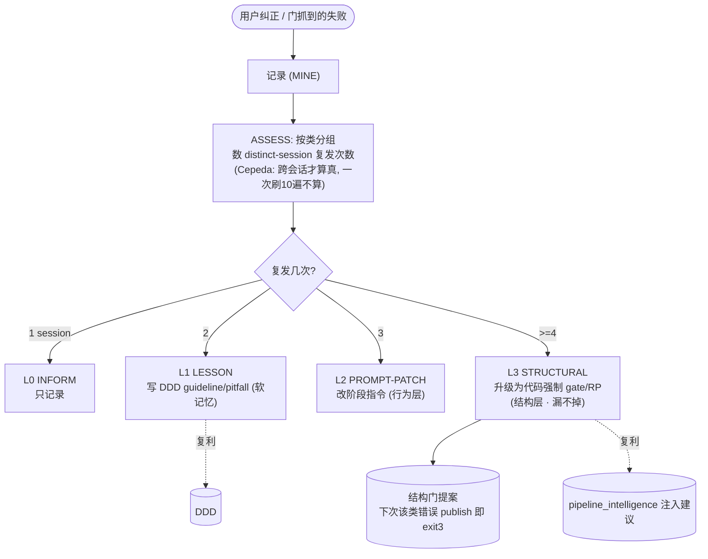
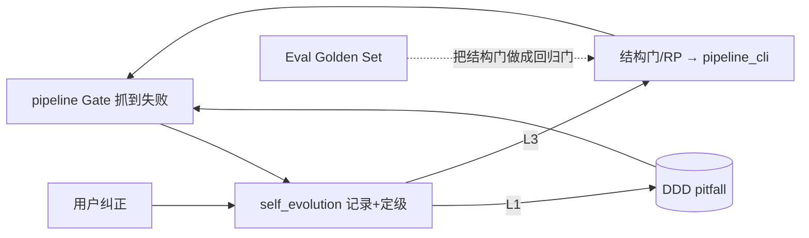

# 自进化 —— 复发错误做成"结构上不可能"（SwarmAI 引擎 #6 移植复盘）

> **一句话**：人靠 carefulness，agent 靠 structure。当一个错误**类**反复出现，不要再加一条"下次小心"的 lesson —— 加一道**代码强制的门**，让这类错误物理上无法再发生。42 条纠正 → 复发类别转化为结构性门控。

---

## 0. 核心思想

普通 memory 系统的做法：犯错 → 加一条 lesson → 下次希望记得。问题是 lesson 靠注意力生效，会衰减、会被淹没。自进化的赌注不同：**把"记性"升级成"结构"**。纠正不是终点，是升级信号。

---

## 1. L0→L3 认知补丁阶梯



**为什么按 distinct-session 而非总次数**（Cepeda 间隔效应）：一次会话里连续踩 5 遍 ≠ 稳定的复发类；跨 5 个不同会话各踩 1 遍才是真正需要结构化的顽疾。防止"刷次数"误触发昂贵的结构门。

---

## 2. MINE → ASSESS → ACT → AUDIT（confidence-gated）

| 阶段 | 做什么 | 安全性 |
|---|---|---|
| **MINE** | 记录纠正（class + text + session） | 只写日志，永远安全 |
| **ASSESS** | 按类分组，数 distinct-session → 定级 L0-L3 | 只读 |
| **ACT** | 到新级别才施加对应补丁（L1 写 DDD / L2 改指令 / L3 出结构门） | **门控**：actuation 才受限 |
| **AUDIT** | 阶梯视图 + 结构门计数 | 只读 |

SwarmAI 的关键原则 **"observe / recommend / act 分离"**:数据管线（MINE+ASSESS）永远安全（只读+写 JSON），执行管线（ACT）按 confidence 门控。任何会改变行为的自主系统都该这么分。

---

## 3. 实测验证（skip-decimal 顽疾爬阶梯）

同一纠正类 `skip-decimal`（写 DynamoDB 漏转 Decimal）跨 4 个 session 复发：

```
s1 -> L0_INFORM        (只记录)
s2 -> L1_LESSON        (写进 DDD pitfall)
s3 -> L2_PROMPT_PATCH  (提示改阶段指令)
s4 -> L3_STRUCTURAL    (生成结构门提案: "给复发类 skip-decimal 加代码强制 gate/RP")
```

到 L3 自动产出结构门提案 → 下一步就该在 `pipeline_cli.py` 加一道 `publish` 时的代码检查，让"写库漏转 Decimal"的交付直接 exit 3。**这与我们前面自然发生的 RP-mc1/2/3 完全同构** —— 它们就是 Gate 2 反复抓到的类，被升级成了 constraint + 注入建议。

---

## 4. 操作命令

```bash
E="python3 pipeline/self_evolution.py"
$E record --class skip-decimal --text "写库漏转Decimal" --session s7   # MINE
$E assess     # 每类的 distinct_sessions + 当前级别
$E act        # 到新级别就施加补丁(L1写DDD / L3出结构门)
$E audit      # L0-L3 阶梯全景 + 结构门计数
```

---

## 5. 与其它引擎的联动（复利闭环的"进化"环）



- 输入:pipeline 的门失败 + 用户纠正。
- 输出:L1→DDD 软记忆、L3→结构门（进 pipeline_cli + Eval 回归门）。
- 效果:错误类**单调递减** —— 每类顽疾最终都被一道门锁死，不再复发。

---

## 6. 现状与差距

**已落地**：纠正记录 · MINE/ASSESS/ACT/AUDIT · L0-L3 阶梯（distinct-session confidence gate）· L1→DDD 写回 · L3 结构门提案。

**相对完整 SwarmAI 仍简化**：SwarmAI 的进化针对 **skill 内容**做 SkillFitness 打分（Jaccard+bigram+containment）+ EvolutionOptimizer 自动改 SKILL.md + `.bak` 回滚；我们做的是**纠正类→结构门**这条主线，没做 skill 自动改写与 fitness 打分。L3 结构门目前是"提案"，把提案真正写成 `pipeline_cli.py` 的代码检查仍是人工一步（有意为之:结构门加代码需人过目）。

> 参考：SwarmAI `docs/Self-Evolution-Harness-Design.md`（MINE→ASSESS→ACT→AUDIT + 7层安全）· 本仓库 `docs/ddd-engine.md`（L1 写回目标）· `docs/eval-os.md`（L3 做成回归门）。
