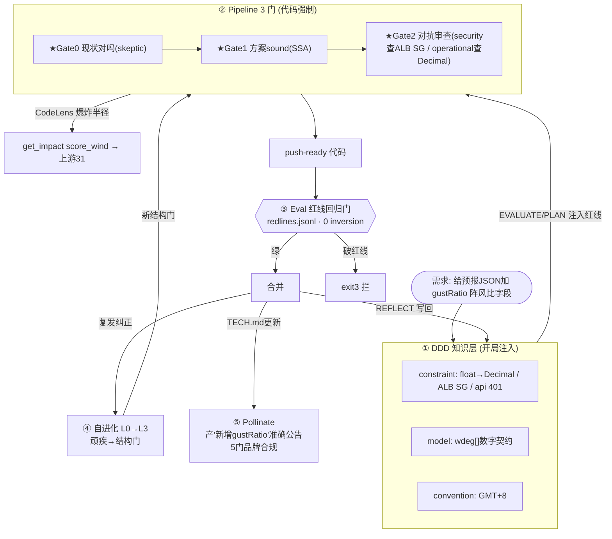
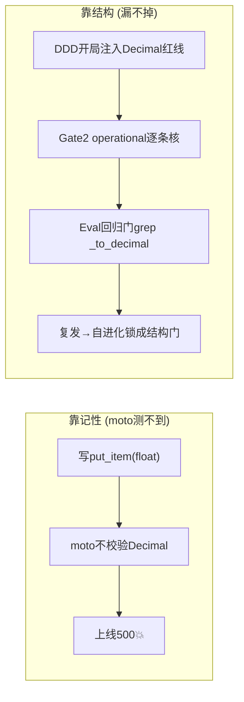

# surf-forecast 全引擎操作手册 —— 收官最终形态怎么用

> **一句话**：在 surf-forecast 上，5 个引擎共享同一套 DDD 知识层协同工作 ——
> **DDD 开局注入红线 → Pipeline 三门把关交付 → Eval 回归门守红线 → 自进化把复发错误锁成结构门 → Pollinate 产品牌正确公告**。
> 你只需一句"run pipeline for X"，其余是结构在替你把关。

---

## 0. 一分钟看懂：一个 surf-forecast 需求怎么流过全系统



---

## 1. 一次性安装（把系统接到 surf-forecast）

```bash
SF=/Users/yiming/Downloads/all_the_meshclaw/surf-forecast/surf-forecast-kiro-v2
PIPE=/Users/yiming/Downloads/all_the_meshclaw/SwarmAI-learning/pipeline

# (a) 全局装 skill，让任何会话能 "run pipeline for X"
cp -r /Users/yiming/Downloads/all_the_meshclaw/SwarmAI-learning/.kiro/skills/autonomous-pipeline ~/.kiro/skills/
# (b) 把引擎脚本放进 surf-forecast，产物落项目内
mkdir -p "$SF/pipeline"; cp "$PIPE"/*.py "$SF/pipeline/"
# (c) DDD 知识层已种(8条红线)：$SF/ddd/knowledge.jsonl  ✅
# (d) CodeLens 事实源：package liangyimingcom/surf-forecast (已索引)
source ~/.meshclaw/secrets/codelens.env    # CODELENS_TOKEN
```

**环境变量（每次开发前 export）：**
```bash
export DDD_STORE="$SF/ddd/knowledge.jsonl"                 # DDD/Pollinate 事实源
export PIPELINE_ARTIFACTS_ROOT="$SF/.pipeline-artifacts"   # run 产物落项目内
cd "$SF" && source .venv/bin/activate                      # same-runtime: 用 surf 自己的 venv
```

---

## 2. 端到端：给 gustRatio 加字段（真实走一遍）

### ①开局 DDD 注入（EVALUATE 就带着红线）
```bash
D="python3 pipeline/ddd.py"
$D inject --stage evaluate    # → 4 红线 constraint + wdeg model + DynamoDB decision
```
> float→Decimal 这条红线在 EVALUATE 就在眼前 —— 不靠记性。

### ②CodeLens 摸底 + 算爆炸半径（PLAN）
```bash
CI="python3 pipeline/code_intel.py"
$CI symbol --package liangyimingcom/surf-forecast --query build_context
$CI impact --package liangyimingcom/surf-forecast --symbol score_wind   # 上游31/下游4
$CI affected-tests --package liangyimingcom/surf-forecast --symbol score_wind
```

### ③Pipeline 三门交付（对我说 "run pipeline for 给预报JSON加gustRatio字段"）
- **Gate 0**:fresh skeptic 核"gustRatio 现在真不存在"
- **Gate 1**:SSA 核方案守红线（wdeg 数字契约、GMT+8）、API 无幻觉
- **Gate 2**:对抗子 agent 专家透镜 —— **security 查 ALB SG、operational 查写库有没有过 `_to_decimal`、api-contract 查 wdeg 契约没破**

### ④Eval 红线回归门（合并前）
```bash
python3 pipeline/eval_os.py --golden $SF/eval/redlines.jsonl --gate   # 破红线→exit3
```
（redlines.jsonl 见 `docs/eval-on-surf-forecast.md`：curl /api/spots 断言401、grep 无 0.0.0.0/0、find_callers _to_decimal…）

### ⑤REFLECT 复利写回 + 自进化
```bash
python3 pipeline/pipeline_cli.py run-cultivate --run-id <id>   # 教训→DDD(guideline/pitfall/constraint)
# 若"漏转Decimal"这类错跨多次复发：
python3 pipeline/self_evolution.py record --class skip-decimal --text "..." --session <s>
python3 pipeline/self_evolution.py act    # 复发到L3→生成结构门提案→加进pipeline_cli
```

### ⑥Pollinate 产公告（功能上线后）
```bash
P="python3 pipeline/pollinate.py"
$P plan --message "浪报新增阵风比 gustRatio" --channel social --complexity low
$P gate --message "..." --format poster --draft "阵风大不大，现在浪报直接告诉你..." --record
```
> Pollinate 的 Gate3 读**同一套 DDD** 当事实源 —— 不会声称不存在的能力。

---

## 3. 红线 → 各引擎护栏（surf-forecast 专属核对表）

| 红线 | DDD(注入) | Pipeline Gate2 专家 | Eval 回归门 |
|---|---|---|---|
| float→Decimal | constraint(全阶段注入) | operational | grep `find_callers _to_decimal` |
| ALB SG 禁 0.0.0.0/0 | constraint | security | `! grep 0.0.0.0/0 infra/` |
| /api/spots 全 401 | constraint | api-contract | `curl → 401` |
| wdeg 数字契约 | model | api-contract | JSON schema 断言 |
| GMT+8 日界 | convention | correctness | 时区边界 pytest |
| terraform 禁 -auto-approve | constraint | operational | `! grep auto-approve` |

**三层防护**:DDD 让红线**开局就在眼前**（判断层）· Pipeline Gate2 让 fresh 视角**逐条核**（对抗层）· Eval 回归门让破红线**exit3 拦发布**（验证层）。同一条红线，三道防线。

---

## 4. 原理：为什么比"直接写代码"稳



- **判断不靠记性**:DDD 把红线注入到你做决策的那一刻。
- **盲点靠 fresh 视角**:Gate 2 的对抗子 agent 碰不到你的思路，专抓你看不见的（float→Decimal 这种）。
- **退化靠回归门**:Eval 0-inversion，破红线直接 exit3。
- **顽疾靠结构门**:同一类错复发到 L3，自进化把它锁成代码强制门，物理上不再发生。
- **知识会复利也会死**:REFLECT 写回 DDD，达尔文衰减淘汰过时知识，prompt 不膨胀。

---

## 5. 最快上手（3 步）

1. `export DDD_STORE=$SF/ddd/knowledge.jsonl && cd $SF && source .venv/bin/activate`
2. 对我说 **「run pipeline for <surf-forecast 需求>」** —— 我自动:DDD 注入红线 → CodeLens 摸底 → 三门把关 → 收敛 → REFLECT 写回。
3. 合并前跑 `eval_os.py --golden eval/redlines.jsonl --gate`；上线后 `pollinate.py` 产公告。

> 参考:`docs/pipeline-on-surf-forecast.md` · `docs/eval-on-surf-forecast.md` · `docs/ddd-on-surf-forecast.md` · `docs/LEARNINGS.md`。
