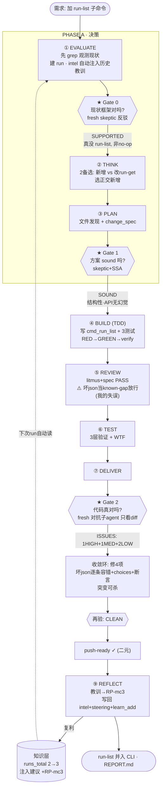
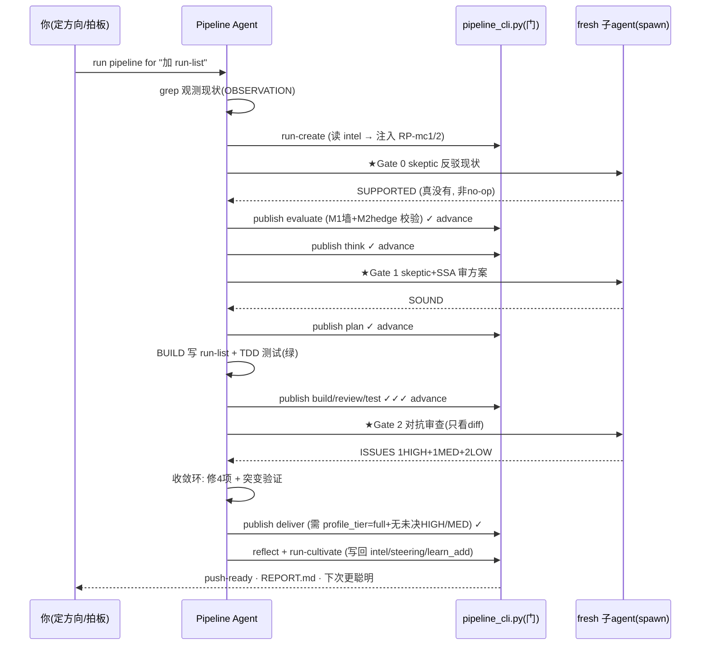

# 实战复盘：用 Autonomous Pipeline 跑一个真实需求

> **需求**：给 `pipeline_cli.py` 增加 `run-list` 子命令，列出所有 run 的 id/profile/status/当前阶段。
> **Run**：`run_1406019f` · profile=`full` · 结果=`completed`（push-ready）。
> 本文把这一次从"一句话需求"到"push-ready 代码"的**全过程、思路、每道门的判断**记录下来，供学习。

---

## 0. 一句话理解这套东西

> 你给一句需求，系统当黑盒交付 push-ready 代码。中间靠 **3 道代码强制的门**保证质量 —— 门是结构，不是叮嘱：一个自信但想跳过的模型，**过不了写在代码里的门**（`publish` 不达标直接 exit 3，无法 `advance`）。

**9 阶段 · 3 门 · 2 模式**：阶段是"做什么"，门是骑在阶段里的 3 个 go/no-go 检查点，模式是"怎么跑"（full 一遍到底 / goal 迭代到 DoD）。

---

## 1. 全景流程图



---

## 2. 逐步讲解（发生了什么 + 为什么）

### ① EVALUATE + ★Gate 0 —— "先搞懂现状，别急着写"
- **动作**：先 `grep run-list pipeline_cli.py` → 确认不存在（这是 **OBSERVATION**，不是猜）。
- **建 run**：`run-create` 时，系统**自动把前两次 run 学到的 RP-mc1、RP-mc2 注入**本次 EVALUATE（`evaluate_must_consider`）。这就是复利。
- **★Gate 0**：spawn 一个**零上下文的 skeptic 子 agent**去反驳"run-list 不存在"这个现状判断。它独立 grep 后回 **SUPPORTED**（还确认了 `run-get` 的 `--run-id` 是 required、不能列全部，所以不是 no-op）。
- **门的意义**：`understanding.claim` 若写成"我要加一个…"（解决方案语言）会被 **M1 墙**挡（claim 必须描述"现在"）；skeptic 裁决不是 SUPPORTED 就**不许 advance**。上一个 run（wtf_gate）我图快先写代码，Gate 0 当场判 `ALREADY-SATISFIED` 把我拦下 —— 门证明了它会挡人。

### ② THINK —— "先想 ≥2 条路，挑对的"
两个备选：**新增独立 run-list**（不碰既有契约）vs **改 run-get 支持无 id**（会破坏 `--run-id` required 契约、语义混淆）。选前者。

### ③ PLAN + ★Gate 1 —— "方案方向对吗？"
列出要改的文件、原子 change_spec；**Gate 1 的 skeptic+SSA** 判 **SOUND**：结构性做法、与既有命令同构、`os.listdir`/`json.load`/`add_parser` 都是真实 API（无幻觉）。

### ④ BUILD —— TDD 红绿
先写会失败的测试，再实现 `cmd_run_list`，跑绿。注入的 RP-mc1/RP-mc2 判定与本命令无关（N/A），但**借用 RP-mc2 的纪律把 `--status` 过滤两侧钉死**。

### ⑤⑥ REVIEW / TEST
litmus + spec 合规 PASS；三层测试过。**但我在这里犯了个错**：把"坏 run.json 不容错"列为 *known-gap* 放行，而不是修。

### ⑦ DELIVER + ★Gate 2 —— "代码真的对吗？"（最关键的门）
spawn **fresh 对抗子 agent，只看 diff、零 builder 偏见**。它抓到 **1 HIGH + 1 MED + 2 LOW**：
- **HIGH**：一个坏/半写 `run.json` 会让**整个 run-list 崩**（`_save_run` 非原子写，并发读命中半写文件真实可发生）—— **正是我 REVIEW 放行的那个 known-gap，被升级为 HIGH**。
- MED：非 dict 的 json → AttributeError。
- LOW：`--status` 无效值静默 count=0；`project` 字段产出却没测。

**收敛环（≤3 轮）**：逐条 `try/except` 隔离坏文件 + `isinstance(dict)` 守卫 + `choices=[...]` + 补 `project` 断言。复验 5 测试全绿，**突变验证**（删过滤行 → 测试变红）证明不是 test-theater。

> 教学点：**Gate 2 的价值 = 抓 builder 自己看不见的盲点**。我离代码太近，把健壮性缺口当"小问题"；碰不到 build 上下文的 fresh 视角直接判它 HIGH。

### ⑧⑨ REFLECT + cultivate —— 闭环复利
把教训提炼成 **RP-mc3**（"聚合读取命令须逐文件容错隔离"），写回三处：
- `pipeline_intelligence.json`（runs_total 2→3，注入建议 +RP-mc3）
- `.kiro/steering/pipeline-lessons.md`（带日期，90 天不引用则衰减）
- `learn_add`（MeshClaw 跨会话 lesson）+ `learn-queue --drain` 标记已处理

**下一次 `run-create` 一开始就会带上 RP-mc1/2/3 三条教训** —— 系统越用越聪明。

---

## 3. 三道门在时间线上怎么串（时序图）



---

## 4. 你能带走的 5 条核心逻辑

1. **门是结构不是叮嘱**：不达标 `publish` 直接 exit 3，`advance` 被拒。自信的模型也绕不过写在代码里的门。
2. **Gate 0 逼你先懂现状**：claim 必须描述"现在"且有 OBSERVATION，禁解决方案语言；skeptic 独立反驳。防"把已完成的当待办""改错地方"。
3. **Gate 2 抓 builder 盲点**：fresh、只看 diff、零偏见 —— 专抓你离代码太近看不见的问题（本次把我放行的 known-gap 升级为 HIGH）。
4. **收敛而非一次完美**：发现→修→复验→突变验证，最多 3 轮；push-ready 是二元判定，没有"差不多"。
5. **知识必须复利且会死**：每次 REFLECT 写回，下次自动注入；90 天不引用则衰减。闭环本身才是产品。

---

## 5. 复现命令（你可以自己再跑一遍）

```bash
cd /Users/yiming/Downloads/all_the_meshclaw/SwarmAI-learning
PIPE="python3 pipeline/pipeline_cli.py"
$PIPE run-create --project demo --requirement "你的需求" --profile full   # 看 intel 注入
# 每阶段: publish(门在此跑) -> advance ; Gate 0/1/2 处 spawn 子agent
$PIPE run-cultivate --run-id <id>   # 复利写回
$PIPE run-list                       # 本次做的功能: 一览所有 run
$PIPE run-report --run-id <id>       # 生成 REPORT.md
```

> 产物见 `pipeline/.artifacts/runs/run_1406019f/REPORT.md`（本次 run 的全阶段 artifact + 门控记录）。
